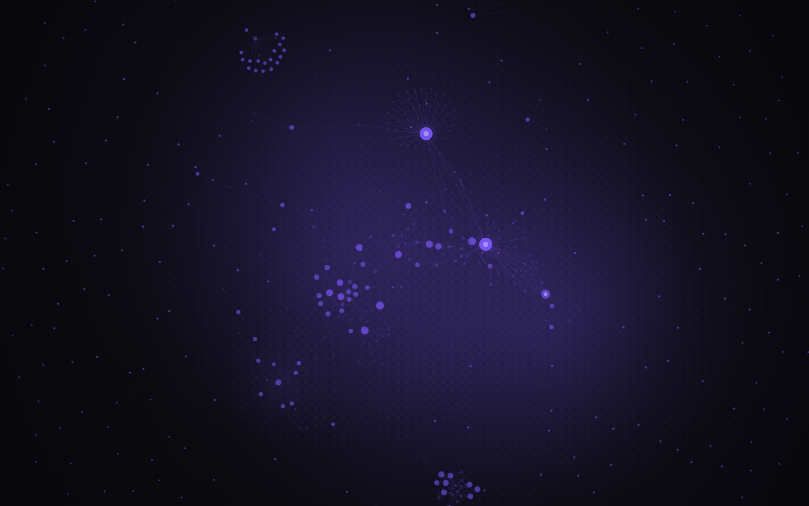
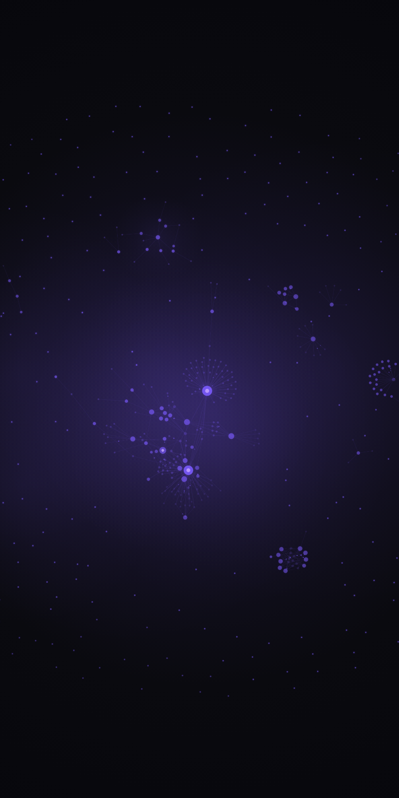

<div align="center">


# AmbientOS

**Turn your Obsidian vault graph into a live desktop wallpaper** — for anyone who wants their knowledge base on screen all day.

<a href="https://github.com/OneByJorah/AmbientOS/stargazers"></a>
<a href="https://github.com/OneByJorah/AmbientOS/commits"></a>
<a href="LICENSE"></a>


</div>


## What This Is

Your notes are a living graph, but you only see it when Obsidian is open. AmbientOS parses a vault into nodes and edges and renders it continuously behind your desktop, refreshing as files change. It ships with 18 hand-tuned presets — from Plain and Ink to Synthwave and Vapor — and a settings UI for tuning physics, glow, depth of field, and clustering without touching config files.

## Quick Start

```bash
git clone https://github.com/OneByJorah/AmbientOS.git
cd AmbientOS
npm install
npm start
```

Open **http://localhost:3000** (or run `npx ambient-os --vault "/path/to/Vault"` to launch without cloning). Point your wallpaper host (Plash, Lively, etc.) at the printed URL.

### Docker

```bash
docker compose up -d
# Serves the static UI on http://localhost:9503
```

## Features

- **Knowledge graph wallpaper** — renders vault notes as an animated force-directed graph.
- **18 presets** — Plain, Ambient, Neon, Dense, Blueprint, Parchment, Botanical, Constellation, Topographic, Contrast, Synthwave, Mist, Crystalline, Confetti, Abyss, Ink, Library, and Vapor.
- **Tag clustering** — groups notes by tag with optional cluster halos.
- **Large-vault scaling** — auto-scales rendering for big vaults (default cap of 5,000 rendered nodes).
- **Real-time updates** — `chokidar` watches the vault and re-parses on change (`refreshMs`, default 5000).
- **Settings UI** — live tuning of animation, glow, particles, labels, edge style, and color mode.
- **Cross-platform** — dedicated setup guides for macOS (Plash), Windows, and Linux.

## Architecture

```
Obsidian Vault ──chokidar watcher──▶ Node.js parser ──HTTP──▶ Wallpaper renderer (D3)
                                          │
                                          ├──▶ Graph builder (nodes / links / tags)
                                          ├──▶ Tag cluster engine
                                          └──▶ Preset manager
```

**Components**

- `parser.js` — parses the vault, serves the app, watches for changes, and writes `graph.json`.
- `index.html` — the D3 graph renderer itself (the wallpaper surface).
- `settings.html` — live settings UI.
- `bin/cli.js` — `npx ambient-os` / `olw` entry point.

## Configuration

Settings live in `config.json` (see `config.example.json`). Key fields:

| Field | Default | Description |
|-------|---------|-------------|
| `vaultPath` | — | Path to your Obsidian vault |
| `port` | `3000` | Local HTTP port |
| `refreshMs` | `5000` | Vault refresh interval (ms) |
| `motionMode` | `balanced` | Animation intensity (`calm` / `balanced` / `showcase`) |
| `maxRenderedNodes` | `5000` | Node cap for large vaults |
| `clusterByTag` | `true` | Group nodes by tag |
| `edgeStyle` | `line` | Edge rendering (`line` / `curve`) |
| `nodeColorMode` | `tag` | Node coloring mode |
| `ignorePaths` | `[".obsidian","templates","_archive"]` | Paths excluded from parsing |

> [!TIP]
> Run `npx ambient-os --vault <path> --port <n>` to scaffold a config and start immediately; open `/settings.html` for live customization.

## Platform Setup

| Platform | Wallpaper host | Notes |
|----------|---------------|-------|
| macOS | Plash | Disable browsing mode so clicks pass through; see [macos-setup.md](macos-setup.md) |
| Windows | Electron / Wallpaper Engine | See [windows-setup.md](windows-setup.md) |
| Linux | X11 or Wayland | See [linux-setup.md](linux-setup.md) |

## Project Structure

```
AmbientOS/
├── index.html                 # Wallpaper renderer (D3)
├── settings.html              # Live settings UI
├── parser.js                  # Vault parser + local server
├── worker.js                  # Graph computation worker
├── renderer-core.js           # Shared renderer helpers
├── presets.json               # All 18 preset definitions
├── config.example.json        # Configuration template
├── bin/cli.js                 # npx entry point
├── vendor/d3.min.js           # Bundled D3
├── scripts/                   # Smoke tests + screenshot helpers
├── docker-compose.yml
└── Dockerfile
```

## Use Cases

1. **Ambient knowledge display** — keep your vault visible as a changing, glanceable backdrop.
2. **Second-monitor context** — reinforce connections between notes while you work.
3. **Vault demos** — show off a knowledge graph on a stream or projector.

## Tech Stack

Node.js (≥18) · D3.js · chokidar · HTML/CSS · Docker · nginx (container)

## Screenshots

| View | |
|---|---|
|  |  |
|  |  |

## Contributing

Contributions are welcome. See [CONTRIBUTING.md](CONTRIBUTING.md) and [CODE_OF_CONDUCT.md](CODE_OF_CONDUCT.md). [Open an issue](https://github.com/OneByJorah/AmbientOS/issues).

## License

MIT — see [LICENSE](LICENSE).

## Connect

- [jorahone.com](https://jorahone.com)
- [GitHub Org](https://github.com/OneByJorah)
- [info@jorahone.com](mailto:info@jorahone.com)
