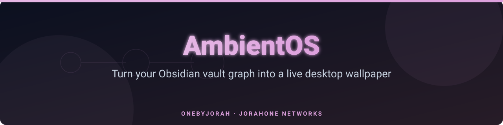
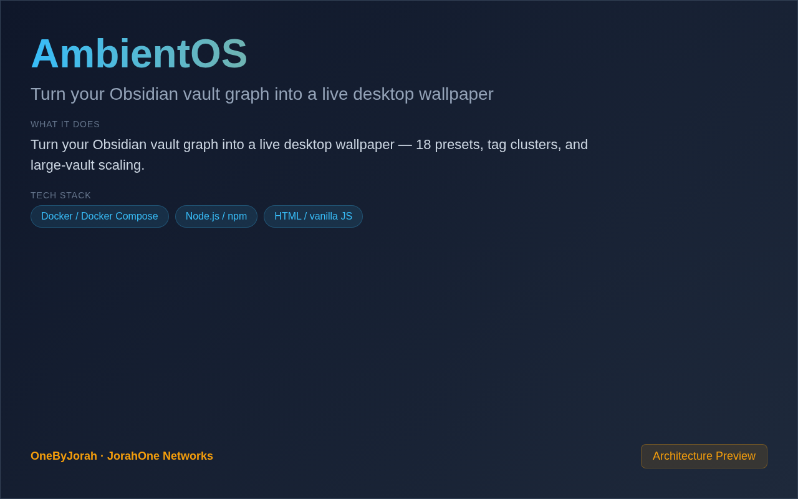

<div align="center">



# AmbientOS

Turn your Obsidian vault graph into a live desktop wallpaper


</div>

---

<p align="center">
  
</p>

<br>

---

## Features

- **Knowledge Graph Visualization** — Render your Obsidian vault as an interactive graph.
- **18 Presets** — Beautiful pre-configured themes and styles.
- **Tag Clusters** — Group notes by tags for visual organization.
- **Large Vault Scaling** — Optimized performance for 10,000+ notes.
- **Cross-Platform** — macOS, Windows, and Linux support.
- **Real-Time Updates** — Auto-refresh when vault changes.
- **Customizable** — Adjust colors, physics, and layout options.
- **Lightweight** — Minimal CPU and memory usage.

## Quick Start

### macOS / Windows / Linux

```bash
git clone https://github.com/OneByJorah/AmbientOS.git
cd AmbientOS

npm install
npm run setup  # Select your Obsidian vault
npm start      # Launch the wallpaper
```

### Docker

```bash
docker compose up -d
```

## Configuration

| Variable | Default | Description |
|----------|---------|-------------|
| `VAULT_PATH` | — | Path to your Obsidian vault |
| `PRESET` | `default` | Theme preset name |
| `POLL_INTERVAL` | `5000` | Vault refresh interval (ms) |
| `PORT` | `3210` | Web interface port |

### Available Presets

| Preset | Description |
|--------|-------------|
| `default` | Clean, minimal graph view |
| `cyberpunk` | Neon-lit futuristic theme |
| `forest` | Nature-inspired green palette |
| `ocean` | Deep blue aquatic theme |
| `sunset` | Warm orange and pink hues |
| `midnight` | Dark mode with subtle glow |
| `retro` | 80s-inspired pixel aesthetic |
| `minimal` | Ultra-clean monochrome |
| `and more...` | 18 total presets |

## Architecture

```
Obsidian Vault ──File Watcher──▶ Node.js Server ──Canvas──▶ Desktop Wallpaper
                                        │
                                        ├──▶ Graph Renderer
                                        ├──▶ Tag Cluster Engine
                                        └──▶ Preset Manager
```

## Project Structure

```
AmbientOS/
├── src/
│   ├── index.js           # Main entry point
│   ├── vault-scanner.js   # Obsidian vault parser
│   ├── graph-renderer.js  # Canvas graph rendering
│   ├── presets/            # Theme preset configurations
│   └── utils/
├── public/
│   ├── index.html         # Web configuration UI
│   └── app.js             # Frontend logic
├── presets.json            # All preset definitions
├── package.json
├── docker-compose.yml     # Docker deployment
└── .env.example           # Configuration template
```

## Platform-Specific Setup

### macOS
- Uses native window for wallpaper
- Requires Accessibility permissions

### Windows
- Uses Electron for wallpaper integration
- Works with Wallpaper Engine

### Linux
- X11: Direct window embedding
- Wayland: Via layer-shell protocol

## Contributing

Contributions are welcome. Please see [CONTRIBUTING.md](CONTRIBUTING.md) for guidelines and [CODE_OF_CONDUCT.md](CODE_OF_CONDUCT.md) for community standards.

## Security

For security concerns, see [SECURITY.md](SECURITY.md). Please report vulnerabilities to **info@jorahone.com** — do not use public issues.

## License

MIT © Jhonattan L. Jimenez

---

## 🤝 Contributing

See [CONTRIBUTING.md](CONTRIBUTING.md). All contributions follow the [Code of Conduct](CODE_OF_CONDUCT.md).

## 🔒 Security

Found a vulnerability? Please follow our [Security Policy](SECURITY.md) and report privately to `security@jorahone.com`.

## 📄 License

[MIT License](LICENSE) © Jhonattan L. Jimenez (OneByJorah)

---

<p align="center">Built with 🌴 by <a href="https://github.com/OneByJorah">OneByJorah</a> · <a href="https://jorahone.com">jorahone.com</a></p>
