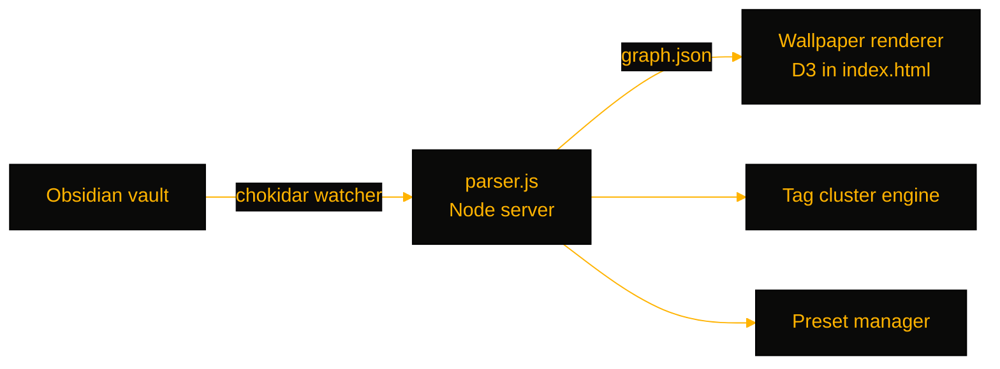

# AmbientOS

> Turn your Obsidian vault graph into a live desktop wallpaper — an animated, D3-rendered knowledge map that refreshes as your notes change.

[](https://github.com/OneByJorah/AmbientOS)
[](https://github.com/OneByJorah/AmbientOS)
[](https://github.com/OneByJorah/AmbientOS/stargazers)
[](https://github.com/OneByJorah/AmbientOS/commits)
[](https://github.com/OneByJorah/AmbientOS/actions)


## What This Is

Your notes are a living graph, but you only see it when Obsidian is open. AmbientOS parses a vault into nodes and edges and renders it continuously behind your desktop, refreshing as files change. It ships with 18 hand-tuned presets — from Plain and Ink to Synthwave and Vapor — and a settings UI for tuning physics, glow, depth of field, and clustering without touching config files. Point a wallpaper host (Plash, Lively, Wallpaper Engine) at the local URL it serves.

## Quick Start

```bash
git clone https://github.com/OneByJorah/AmbientOS.git
cd AmbientOS
npm install
npm start
```

Open **http://localhost:3000**, or run `npx ambient-os --vault "/path/to/Vault"` to launch without cloning. Docker: `docker compose up -d` serves on **:9503**.

## Features

- **Knowledge graph wallpaper** — vault notes rendered as an animated force-directed graph.
- **18 presets** — Plain, Ambient, Neon, Dense, Blueprint, Parchment, Botanical, Constellation, Topographic, Contrast, Synthwave, Mist, Crystalline, Confetti, Abyss, Ink, Library, and Vapor.
- **Tag clustering** — groups notes by tag with optional cluster halos.
- **Large-vault scaling** — auto-scales rendering for big vaults (default cap of 5,000 rendered nodes).
- **Real-time updates** — `chokidar` watches the vault and re-parses on change (`refreshMs`, default 5000 ms).
- **Live settings UI** — tuning for animation, glow, particles, labels, edge style, and color mode at `/settings.html`.
- **Cross-platform** — dedicated setup guides for macOS (Plash), Windows, and Linux.

## Architecture



- `parser.js` — parses the vault, serves the app, watches for changes.
- `index.html` — the D3 graph renderer (the wallpaper surface itself).
- `settings.html` — live settings UI.
- `bin/cli.js` — `npx ambient-os` / `olw` entry point.

## Stack

Node.js (≥18) · D3.js · chokidar · HTML/CSS · Docker

## Contributing

See [CONTRIBUTING.md](CONTRIBUTING.md) and [CODE_OF_CONDUCT.md](CODE_OF_CONDUCT.md). [Open an issue](https://github.com/OneByJorah/AmbientOS/issues) for bugs or ideas.

## License

MIT — see [LICENSE](LICENSE).
